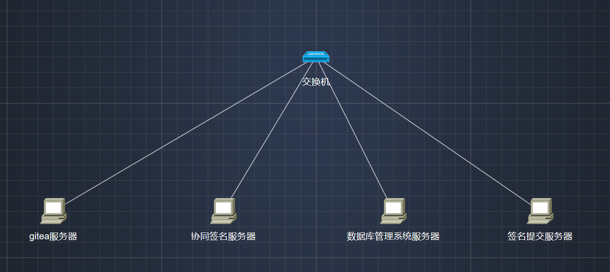

# 熵密杯附件整理-备注

## 题目信息

三道初始谜题（CTF）带交互机，解出任意一道可访问场景题目。

场景题目共4台机器，5个flag

## 场景题目信息

### 网络拓扑

网络拓扑图不需要逐一解出即全部给出

### 场景解题顺序

1. 在Gitea上下载到`shangmibei-master.zip`，在其中解出加密口令解压`协同签名源码文件.zip`，得到flag1

2. 然后通过`数据库管理系统数据.zip`中的文件破解数据库管理系统服务器，进入后台拿到flag3和附件
3. 在第一步解出后的附件中可破解协同签名服务器，交互得到flag2
4. 在第二步得到的附件中解密流量文件，找到flag4
5. 在完成上述步骤后伪造总经理签名提交给签名提交服务器，得到最终flag5

### 其他

1. 数据库管理系统服务器有用根密钥指定公钥派发证书的register接口
2. 协同签名服务器交互流程与`总经理协同签名流量包`相同
3. 签名提交服务器的给定 msg_hash 为`9e810778a6b177c6aa1799365977adfbeef605c19b5ea917527d1541c1339019`

